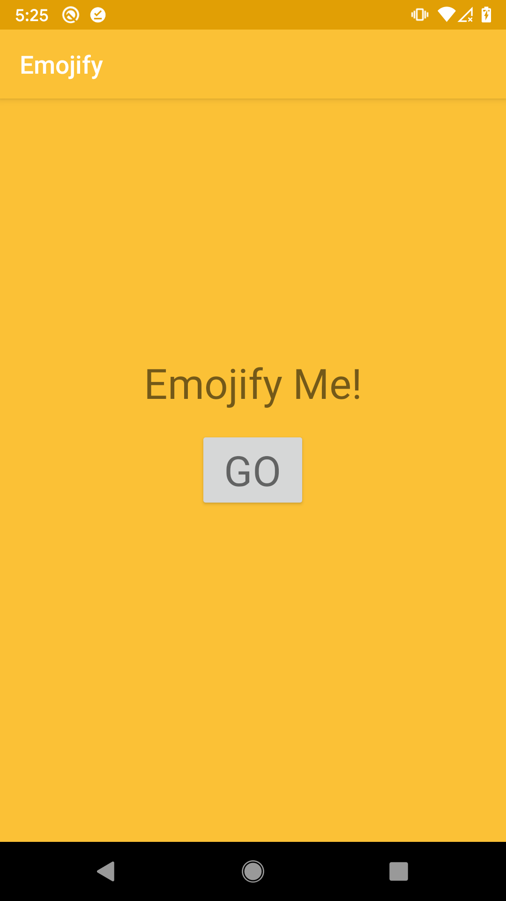
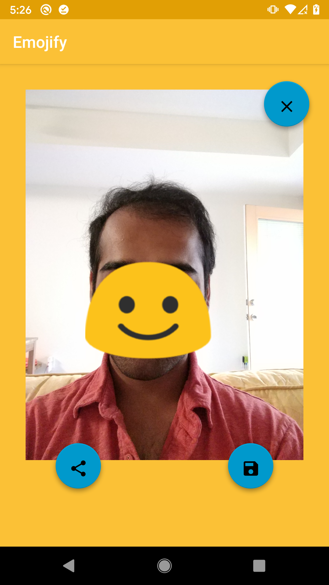

## EmojifyMe

Emojify Me is a fun android application that makes use of facial recognition to turn a user's picture into an emoji. 
Uses Google's Mobile Vision library to help with facial recognition. 

This application was developed as part of Udacity's Android Developer Nanodegree.

### Libraries Used
1. ButterKnife: Provides View Binding using annotations
2. Timber: Efficient Logging
3. Google's Mobile Vision: Facial Recognition

### Screeenshots
#### Home Page

#### My husband helping me demo the app.

